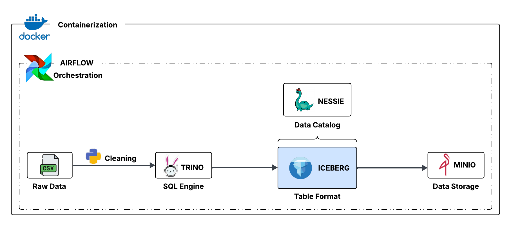

<!-- Improved compatibility of back to top link: See: https://github.com/othneildrew/Best-README-Template/pull/73 -->
<a id="readme-top"></a>
<!--
*** Thanks for checking out the Best-README-Template. If you have a suggestion
*** that would make this better, please fork the repo and create a pull request
*** or simply open an issue with the tag "enhancement".
*** Don't forget to give the project a star!
*** Thanks again! Now go create something AMAZING! :D
-->


<!-- PROJECT SHIELDS -->
<!--
*** I'm using markdown "reference style" links for readability.
*** Reference links are enclosed in brackets [ ] instead of parentheses ( ).
*** See the bottom of this document for the declaration of the reference variables
*** for contributors-url, forks-url, etc. This is an optional, concise syntax you may use.
*** https://www.markdownguide.org/basic-syntax/#reference-style-links
-->
[![LinkedIn][linkedin-shield]][linkedin-url]


<!-- PROJECT LOGO -->
<br />
<div align="center">
  <a href="https://github.com/HansDoh2404/datalake_trino_iceberg_minio">
    
  </a>

  <h3 align="center">Datalake - trino iceberg minio</h3>
</div>


<!-- TABLE OF CONTENTS -->
<details>
  <summary>Sommaire</summary>
  <ol>
    <li>
      <a href="#about-the-project">A propos du projet</a>
      <ul>
        <li><a href="#built-with">Stack technologique</a></li>
      </ul>
    </li>
    <li>
      <a href="#getting-started">Getting Started</a>
      <ul>
        <li><a href="#prerequisites">Prerequisites</a></li>
        <li><a href="#installation">Installation</a></li>
      </ul>
    </li>
    <li><a href="#usage">Usage</a></li>
    <li><a href="#roadmap">Roadmap</a></li>
    <li><a href="#contributing">Contributing</a></li>
    <li><a href="#license">License</a></li>
    <li><a href="#contact">Contact</a></li>
    <li><a href="#acknowledgments">Acknowledgments</a></li>
  </ol>
</details>


<!-- ABOUT THE PROJECT -->
## A propos du projet

**Le projet implémenté, est un datalake dont l'objectif est de centraliser et faciliter le traitement de données massives en suivant une approche ELT** afin de produire des analyses futures, notamment l'exploration du passé, l'identification de tendances, et le support de la conformité et de la planification stratégique. L'histoire du datalake est liée à la volonté de dépasser les limites des data warehouses en permettant de stocker des données sans schéma prédéfini.


### Stack technologique

Les différents outils technologiques utilisés pour son implémentation sont les suivants

* [![Python][python]][python-url]
* [![Trino][trino]][trino-url]
* [![Nessie][nessie]][nessie-url]
* [![Minio][minio]][minio-url]
* [![Airflow][airflow]][airflow-url]
* [![Docker][docker]][docker-url]


<p align="right">(<a href="#readme-top">haut de page</a>)</p>


<!-- GETTING STARTED -->
## Lancdement du projet

This is an example of how you may give instructions on setting up your project locally.
To get a local copy up and running follow these simple example steps.

### Pré-recquis

This is an example of how to list things you need to use the software and how to install them.
* npm
  ```sh
  npm install npm@latest -g
  ```

### Installation

_Below is an example of how you can instruct your audience on installing and setting up your app. This template doesn't rely on any external dependencies or services._

1. Get a free API Key at [https://example.com](https://example.com)
2. Clone the repo
   ```sh
   git clone https://github.com/github_username/repo_name.git
   ```
3. Install NPM packages
   ```sh
   npm install
   ```
4. Enter your API in `config.js`
   ```js
   const API_KEY = 'ENTER YOUR API';
   ```
5. Change git remote url to avoid accidental pushes to base project
   ```sh
   git remote set-url origin github_username/repo_name
   git remote -v # confirm the changes
   ```

<p align="right">(<a href="#readme-top">back to top</a>)</p>


<!-- CONTACT -->
## Contact

Your Name - [@your_twitter](https://twitter.com/your_username) - email@example.com

Project Link: [https://github.com/your_username/repo_name](https://github.com/your_username/repo_name)

<p align="right">(<a href="#readme-top">back to top</a>)</p>


<!-- ACKNOWLEDGMENTS -->
## Utiles

Use this space to list resources you find helpful and would like to give credit to. I've included a few of my favorites to kick things off!

* [Choose an Open Source License](https://choosealicense.com)
* [GitHub Emoji Cheat Sheet](https://www.webpagefx.com/tools/emoji-cheat-sheet)
* [Malven's Flexbox Cheatsheet](https://flexbox.malven.co/)
* [Malven's Grid Cheatsheet](https://grid.malven.co/)
* [Img Shields](https://shields.io)
* [GitHub Pages](https://pages.github.com)
* [Font Awesome](https://fontawesome.com)
* [React Icons](https://react-icons.github.io/react-icons/search)

<p align="right">(<a href="#readme-top">back to top</a>)</p>


<!-- MARKDOWN LINKS & IMAGES -->
[linkedin-shield]: https://img.shields.io/badge/-LinkedIn-black.svg?style=for-the-badge&logo=linkedin&colorB=555
[linkedin-url]: https://www.linkedin.com/in/hans-ariel-doh-59a31a2ba/
[python]: https://img.shields.io/badge/Python-blue?style=for-the-badge&logo=python&logoColor=white
[python-url]: https://docs.python.org/3/
[nessie]: https://img.shields.io/badge/Nessie-green?style=for-the-badge&logo=nesie&logoColor=white
[nessie-url]: https://docs.python.org/3/
[trino]: https://img.shields.io/badge/trino-%23FF69B4?style=for-the-badge&logo=trino&logoColor=white
[trino-url]: https://trino.io/docs/current/index.html
[minio]: https://img.shields.io/badge/minio-red?style=for-the-badge&logo=minio&logoColor=white
[minio-url]: https://docs.min.io/enterprise/aistor-object-store/
[airflow]: https://img.shields.io/badge/airflow-%2300338F?style=for-the-badge&logo=apache-airflow&logoColor=white
[airflow-url]: https://airflow.apache.org/docs/
[docker]: https://img.shields.io/badge/docker-%231D63ED?style=for-the-badge&logo=docker&logoColor=white
[docker-url]: https://docs.docker.com/